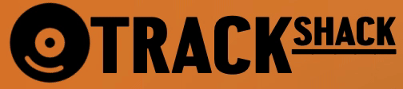

# Enter the [Track Shack!](https://track-shack.netlify.app/)

[%5D.linesOfCode&label=lines%20of%20code)](https://github.com/KooShnoo/track-shack)

Hey there musician! Have you got a track that's got great potential, but its missing a few things? Maybe a part from an instrument you can't play? ***take it into the [Track Shack®](https://track-shack.netlify.app/)!*** at the Track Shack, you can collaborate with musicians who play different instruments to produce one great track, combining all your talents.

### Background 

Track Shack is a social media applicaiton that is designed to create an environment that allows musicians to post their current projects and seek collaboration with musicians of other musical persuasions. We wanted to develop an application that allows musicians to more easily find the missing components they need when writting music. 

Ex: If a user plays a guitar and they are interested adding drums to it, then they could post an audio clip of the current piece and specificy that they are looking for someone to add drums to the audio file. Another user can then download that audio file, re-record it with their drum beat, and comment on the original post with their new audio file for the original poster to download!

### MVP 

* User auth
* User profile
* Audio player bar
    - Ability to play/pause
    - Scrub through the track
    - Download the track 
* Comments (text only)
    - Users can comment on another users upload 
* Music post (original idea and responses)
    - Users can make posts
    - Users can delete posts 
    - Users can edit/update posts
    - Users can respond to others users posts with their own audio clips
* Text content: title, description
* Audio content
* Tags
    - Users can add tags to their posts (ex: GUITAR, DRUM, SAX)
    - Users can filter posts by tags 
* Audio hosting (hosting audio files)

### Wireframes

### Technologies
* MongoDB
* Express
* React 
* Node.js
* Typescript

### The Shackers
* Cole Manel - Lead Flex 
* Ishan Chawla - Lead Backend 
* Jake Tabor - Lead Frontend 
* David Maine - Project Lead

### Work Breakdown 
* Jan 26-28 - User Auth 
    - All roles involved 
* Jan 29 - Audio Player Bar 
    - Flex, Backend, Frontend
* Jan 30 - Comments 
    - Backend, Frontend 
* Jan 31 - Music Posts
    - All roles involved
* Jan 32 - Tags / CSS
    - Backend, Flex 
    - Frontend, Project Lead
* Jan 33 - Finalize applications looks 
    - All roles involved

